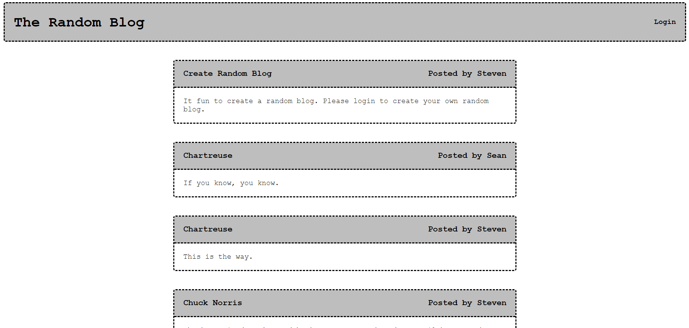
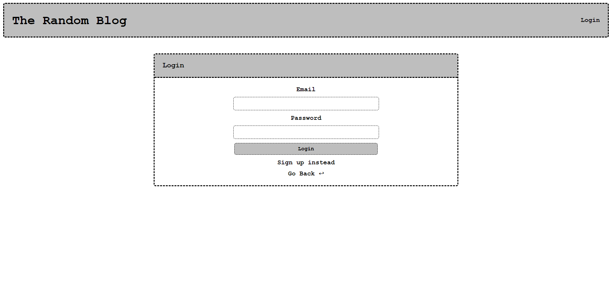
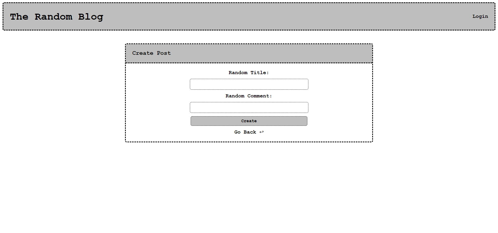

# the-random-blog

## Description
This project is to create a random blog where a user can sign-up or login to a personal profile. After the user is logged in they can create a post to the main blog thread.
## Table of contents
- [Mock-up](#Mock-up)
- [Installation](#Installation)
- [Usage](#Usage)
- [Contribution](#Contributing)
- [Test](#Test)
- [Questions](#Questions)
- [Diployment Links](#Questions)
## Mock-up

Landing Page

Login

Create Post

## Installation
dotenv

express

mysql2

sequelize
## Usage
mysql -u root -p

source db/schema.sql

npm run seed

npm start
## Contributing
Steven Green

## Questions
GitHub Username: [mrgreen12375](https://github.com/mrgreen12375)

Email Address: [sbgreen.dev@gmail.com](sbgreen.dev@gmail.com)
## Deployment Links
Heroku: https://the-random-blog-4cd09b62d1ef.herokuapp.com/

GitHub Repo: https://github.com/mrgreen12375/the-random-blog